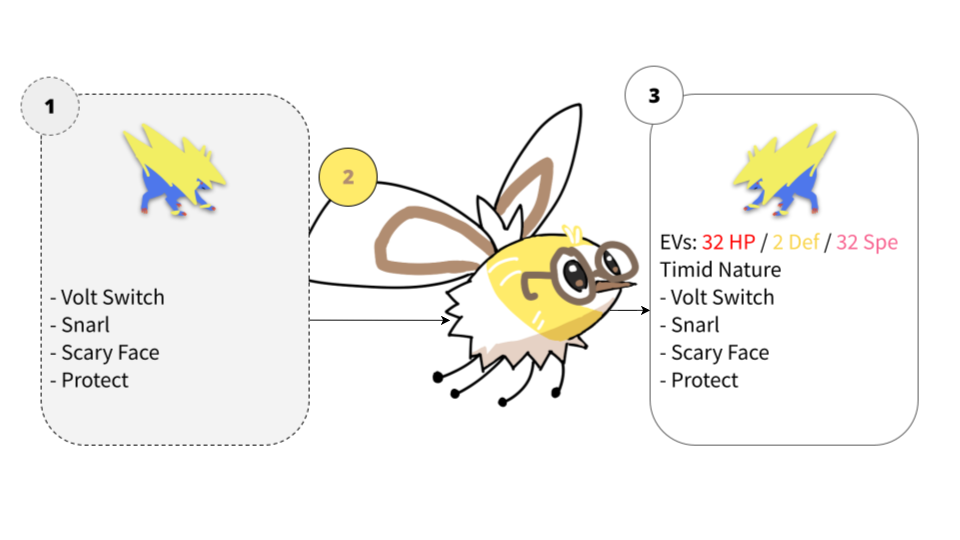

# 초파리 뇌는 포켓몬 OTS를 읽을 수 있을까?

**Eunha 은하**

[**프로젝트 페이지**](https://eunhavgc.github.io/flypaste)

<p align="center">
  
</p>

VGC 오픈팀시트(OTS)에는 종족·지닌 물건·특성·기술이 공개되지만 **노력치와 성격은 가려져 있습니다.**
OTS에 적힌 이름 하나하나를 초파리가 냄새를 받는 투사뉴런에 배정해 자극하고,
MaleCNS 커넥톰의 버섯체 뉴런 5,191개를 그대로 시뮬레이션한 반응으로 가려진 두 값을 추정합니다.
배선은 커넥톰 그대로이고, 학습으로 바뀌는 것은 Kenyon cell에서 출력으로 가는 시냅스의 세기뿐입니다.

## 결과

레귤레이션 M-A·M-B의 약 1,700개 팀으로 학습하고, 학습에 쓰지 않은 M-C의 팀으로 시험했습니다.

| | EV 오차 ↓ | 완전 일치 ↑ |
|---|---|---|
| 성격을 알 때 | **약 12점** | **약 25%** |
| 성격을 모를 때 | 약 16점 | 18% |
| 최빈값 기준선 | 약 23점 | 14% |

EV 오차는 예측과 정답의 차이를 모두 더해 2로 나눈 값입니다. 66점을 얼마나 어긋나게 나눴는지를 뜻합니다.

## 공개 예정

추론 코드와 학습된 가중치(`.safetensors`)를 이 저장소에 공개할 예정입니다.
OTS가 적힌 텍스트를 넣으면 노력치와 성격을 채운 페이스트가 나오는 형태입니다.

학습·시험에 쓴 대회 팀 페이스트는 재배포하지 않습니다.
커넥톰 원본(MaleCNS v1.0, 약 1.1GB)도 포함하지 않으므로 공식 배포처에서 따로 받으셔야 합니다.

## Citation

```bibtex
@misc{eunha2026flypaste,
title={Can a Fly Brain Read Pok\'emon Open Team Sheets?},
author={Eunha},
year={2026},
note={MaleCNS connectome mushroom body for EV spread and nature recovery},
howpublished={\url{https://eunhavgc.github.io/flypaste/}}
}
```
